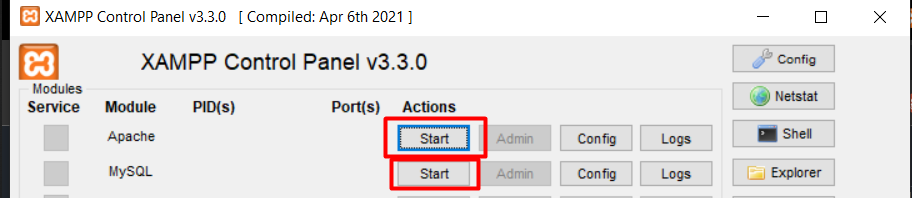
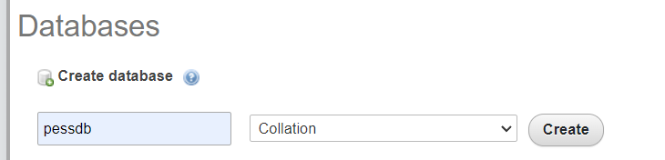

# How to use this sql file
<h2>Overview</h2>
-Well if you were to somehow stumble upon this project and would like to check it out yourself but do not know how to set up sql I'll explain in the folowing steps. This is obviously a very basic step by step guide, unnecessary if you know how to set up databases, import and export sql files. 

 <h1>- For windows and linux</h1>
- Turn on your apache and mysql with xampp   

- Go to your browser ctrl+l and type localhost/phpmyadmin  

= Click on new on the left panel and add a database with name pessdb and collation type.

-Then import the phpProjectDb.sql to phpmyadmin
- Your sql file has been exported to phpmyadmin and you are finished.
    <h3>Note for xampp</h3>
    
(Apache and mysql works on xampp/mamp which works on most Unix operating system e.g. mac, linux, window operating system or wsl which imports linux distro.) Due to xampp being installed on rpm certain distro may not support it like arch based linux such as arch/manjaro. Maybe there is a aur for xampp that you can pacman -S for it. There are definitely work arounds to this for arch and others alike. For ubuntu users like myself, no problemo!
 

 <h1>- For mac</h1>
- Click connect with mamp
- Go to your browser ctrl+l and type localhost:8888/phpmyadmin
- Click on new on the left panel and add a database with name pessdb and collation type.
-Then import the phpProjectDb.sql to phpmyadmin
- Your sql file has been exported to phpmyadmin and you are finished. 

# How to go to website
- localhost/phpProject/fileName.php   Change fileName to the file you want to see.